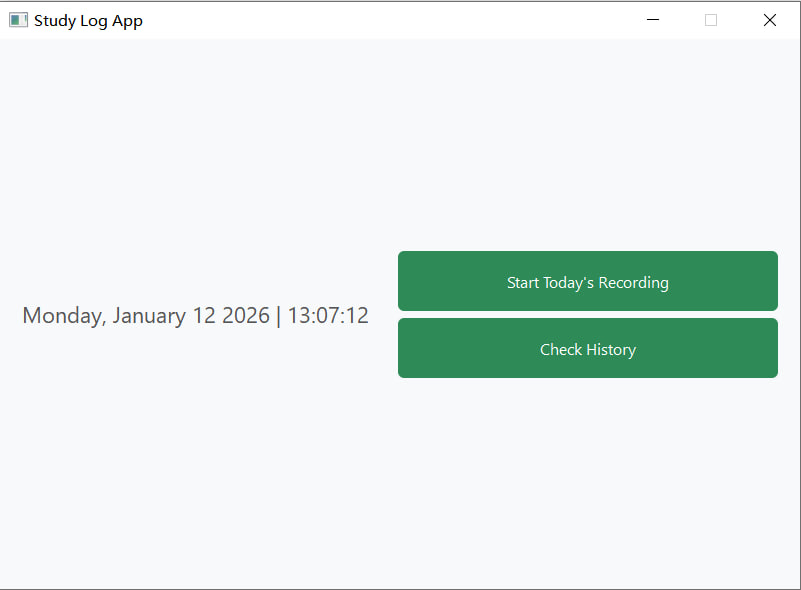
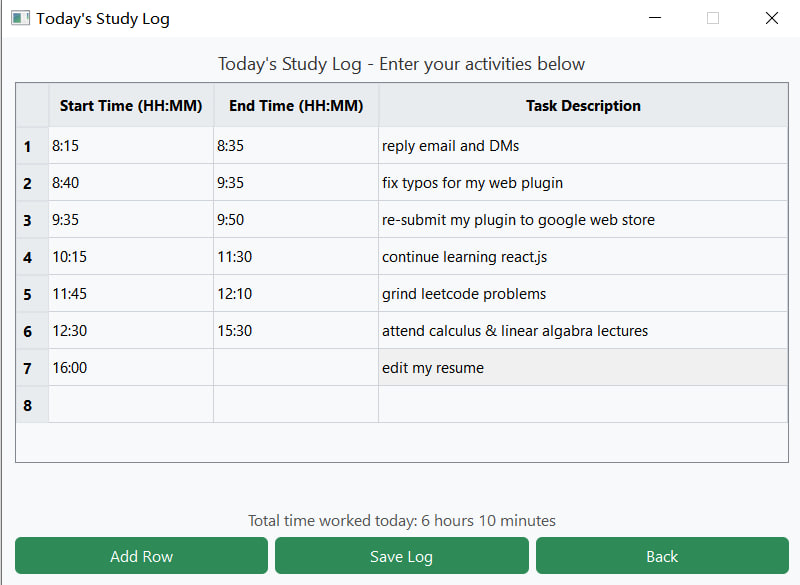
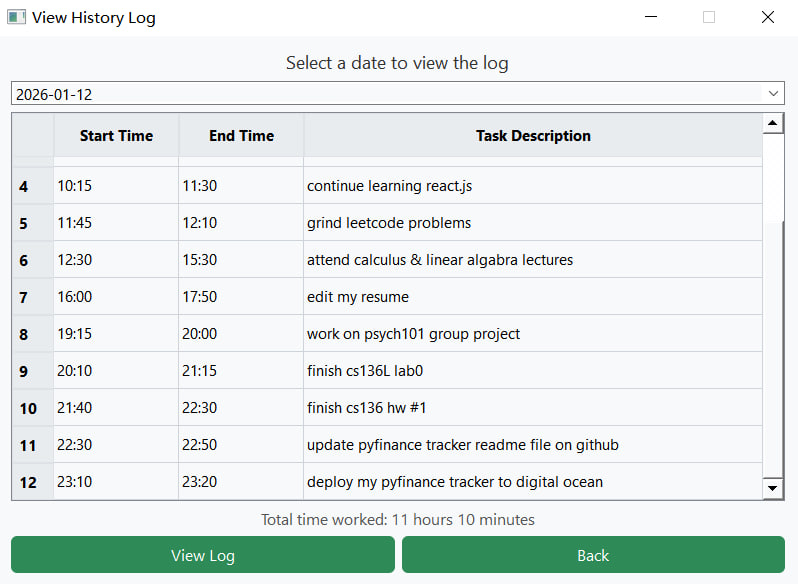

# 📝 Daily Study Log App

A lightweight, modern desktop application built with **Python** and **PyQt5** designed to help students and professionals track their daily study or work activities efficiently. 

The application features a clean, CSS-styled interface (QSS), real-time duration calculation, and a history review system powered by local JSON storage.

## 📸 Screenshots

### 1. Main Dashboard
The landing page features a minimalistic design with a live digital clock and date display.


### 2. Daily Entry Logger
Users can add tasks dynamically. The app **automatically calculates** the total duration based on the Start and End times provided.


### 3. History Viewer
A built-in calendar allows users to navigate through past dates and review their productivity logs.


---

## ✨ Key Features

* **Real-Time Dashboard:** Displays the current date and time (HH:MM:SS) with a modern, readable font.
* **Smart Time Calculation:** Automatically computes the duration of each task in real-time. It aggregates the total hours and minutes worked for the day immediately upon data entry.
* **Persistent Storage:** Uses a custom JSON-based backend (`log_manager.py`) to save logs locally. Data persists across sessions without needing an external database server.
* **Historical Review:** Includes a date-picker widget to retrieve and display logs from any previous date.
* **Modern UI/UX:** Styled using QSS (Qt Style Sheets) with a "Sea Green" color palette, custom fonts (Segoe UI), and hover effects for a responsive feel.

---

## 🛠️ Technical Stack

* **Language:** Python 3.8
* **GUI Framework:** PyQt5 (Qt Widgets)
* **Data Storage:** JSON (Local file system)
* **Modules Used:** `sys`, `os`, `json`, `datetime`

---

## 🚀 Installation & Setup

1.  **Clone the repository** (or download the source code):
    ```bash
    git clone [https://github.com/yourusername/study-log-app.git](https://github.com/yourusername/study-log-app.git)
    cd study-log-app
    ```

2.  **Install Dependencies:**
    This project requires `PyQt5`. You can install it via pip:
    ```bash
    pip install PyQt5
    ```

3.  **Run the Application:**
    Navigate to the project directory and execute the main script:
    ```bash
    python main.py
    ```

---
## 📂 Project Structure

```text
study-log-app/
├── images/              # Screenshot assets for README
│   ├── demo_1.jpg
│   ├── demo_2.jpg
│   └── demo_3.jpg
├── logs/                # Automatically generated folder for JSON storage
├── log_manager.py       # Handles JSON reading/writing logic
├── main.py              # Application entry point and CSS styling
├── ui_main.py           # Main dashboard UI logic
├── ui_log_entry.py      # Daily logging interface logic
└── ui_history.py        # History viewing interface logic
```

## 🔮 Future Improvements

Here are some planned features to further enhance the application:

* **📊 Data Visualization:** Integrate `Matplotlib` or `PyQtChart` to display weekly and monthly study trends visually.
* **📥 Export Functionality:** Add support for exporting logs to **CSV** or **Excel** formats for external analysis.
* **🗄️ Database Migration:** Transition from JSON files to **SQLite** for more robust data querying and handling larger datasets.
* **✏️ Edit History:** Allow users to modify or delete past log entries directly from the History View.
* **⏱️ Pomodoro Timer:** Integrate a built-in timer to help users manage study sessions directly within the app.